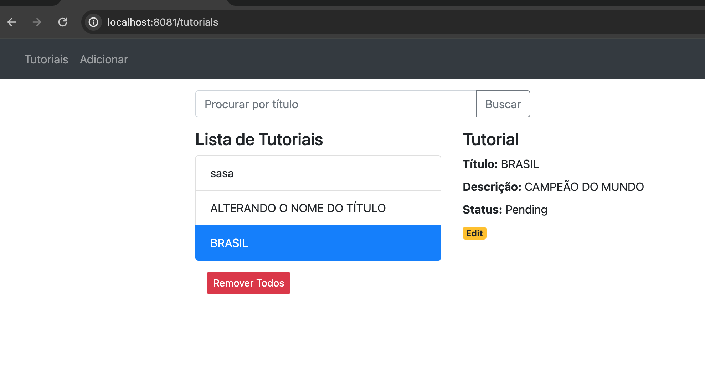

# Angula 13 Consumindo API Spring Boot 3

Exemplo de aplicativo Angular CRUD para consumir APIs Rest, exibir, modificar e pesquisar dados.

Aplicação Tutorial em que:
- Cada Tutorial possui id, título, descrição, status de publicação.
- Podemos criar, recuperar, atualizar, excluir Tutoriais.
- Existe uma barra de pesquisa para encontrar tutoriais por título.

No terrninal execute: ng serve --port 8081 para um servidor de desenvolvimento. No navegador: http://localhost:8081/. 

